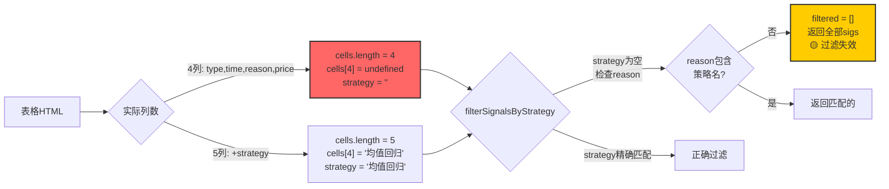
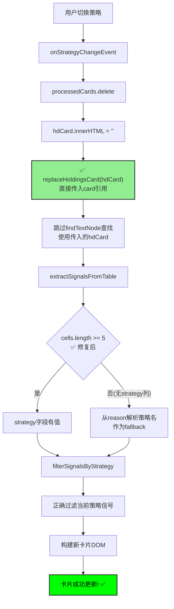
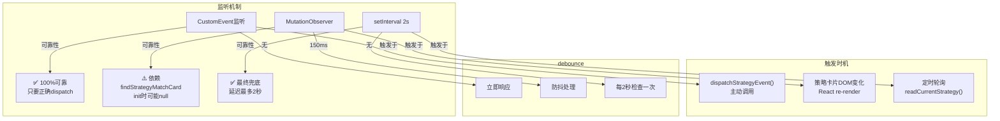

# 策略联动数据流 - Mermaid可视化图

## 图1: 完整数据流（修复前）

```mermaid
flowchart TD
    subgraph "阶段1: 信号提取与卡片构建"
        A1[页面加载/路由变化] --> A2[runAll]
        A2 --> A3[replaceHoldingsCard]
        A3 --> A4{findTextNode<br/>'持仓管理'/'买卖信号'}
        A4 --"找到"--> A5[信号提取]
        A4 --"❌ 找不到"--> A6[return, 无操作]

        A5 --> A7{两条路径<br/>二选一}
        A7 -->|"Path A: flex items"| A8[".flex.items-center.gap-2<br/>spans[0-4]<br/>⚠️ 检查>=4取第5个"]
        A7 -->|"Path B: table rows"| A9["extractSignalsFromTable()<br/>cells[0-4]<br/>⚠️ 检查>=4取第5个"]

        A8 --> A10[sigs数组<br/>{type,time,reason,price,strategy}]
        A9 --> A10

        A10 --> A11[window._signalState.allSignals = sigs]
        A11 --> A12[readCurrentStrategy]
        A12 --> A13{findStrategyMatchCard}
        A13 -->|"查找'策略匹配'"| A14[在策略卡片内搜索]
        A13 -->|"fallback: xx%匹配度"| A14
        A14 --> A15{4种方法匹配策略名<br/>⚠️ 硬编码列表<br/>⚠️ 精确匹配}
        A15 --> A16[currentStrategy]

        A10 --> A17[filterSignalsByStrategy<br/>(sigs, currentStrategy)]
        A16 --> A17
        A17 --> A18{filtered.length > 0<br/>&& < sigs.length}
        A18 --"是"--> A19[sigs = filtered]
        A18 --"否"--> A20[保留全部sigs]
        A19 --> A21[构建卡片DOM<br/>innerHTML='']
        A20 --> A21
        A21 --> A22[processedCards.add(hdCard)]
    end

    subgraph "阶段2: 监听机制"
        B1[startStrategyLinkage] --> B2["监听1: addEventListener<br/>'strategyChanged'"]
        B1 --> B3{findStrategyMatchCard}
        B3 --"找到卡片"--> B4["监听2: MutationObserver<br/>⚠️ init时可能未渲染"]
        B3 --"❌ null"--> B5["Observer未附加"]
        B1 --> B6["监听3: setInterval<br/>2000ms轮询"]
    end

    subgraph "阶段3: 策略切换响应"
        C1[用户点击策略按钮] --> C2[React更新DOM]
        C2 --> C3[MutationObserver触发]
        C2 --> C4["2秒后轮询捕获"]
        C3 --> C5[readCurrentStrategy]
        C4 --> C5
        C5 --> C6[dispatchStrategyEvent<br/>newStrategy]
        C6 --> C7["CustomEvent<br/>'strategyChanged'"]
        C7 --> C8[onStrategyChangeEvent]
        C8 --> C9{newStrategy ===<br/>currentStrategy?}
        C9 --"相同"--> C10[return]
        C9 --"不同"--> C11[currentStrategy = newStrategy]
        C11 --> C12["查找卡片: .data-card<br/>包含'买卖信号'文本"]
        C12 --> C13[processedCards.delete]
        C13 --> C14[hdCard.innerHTML = '']
        C14 --> C15["🔴 replaceHoldingsCard()<br/>findTextNode('买卖信号')<br/>❌ 找不到! 已清空!<br/>❌ return, 不重建!"]
    end
```

## 图2: 核心断裂点放大

```mermaid
flowchart LR
    A[策略切换触发] --> B[hdCard.innerHTML = '']
    B --> C{findTextNode<br/>'买卖信号'}
    C -->|"❌ 文本已被清空<br/>不存在了"| D[hdNode = null]
    D --> E[if (!hdNode) return]
    E --> F["🔴 卡片永不重建!<br/>页面卡死在空卡片状态"]

    style F fill:#ff0000,color:#fff,stroke:#333,stroke-width:2px
    style C fill:#ffcc00,stroke:#333,stroke-width:2px
```

## 图3: 信号strategy字段断裂



## 图4: 修复后的正确流程



## 图5: 三大监听机制对比


